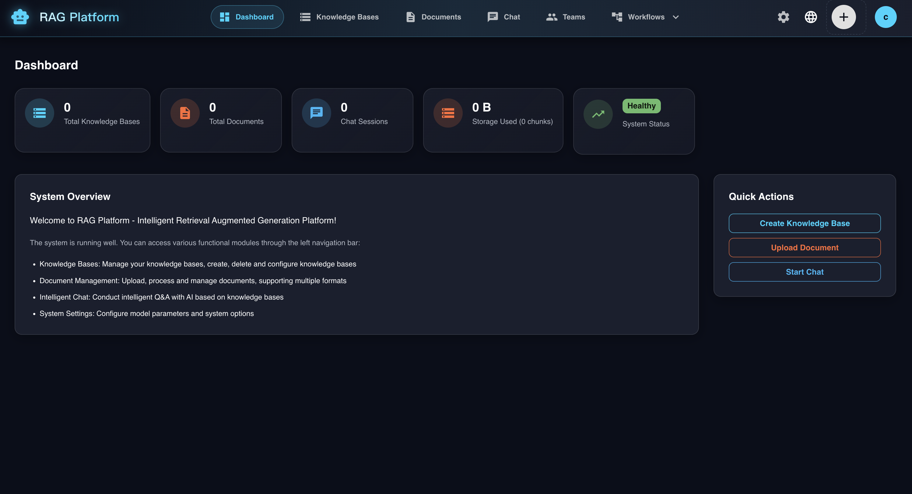
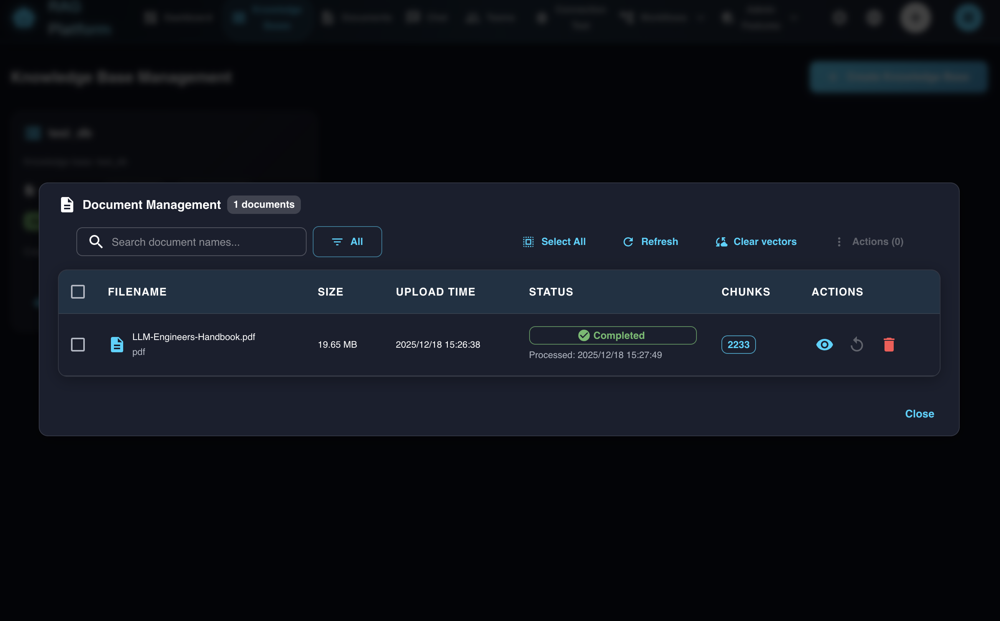
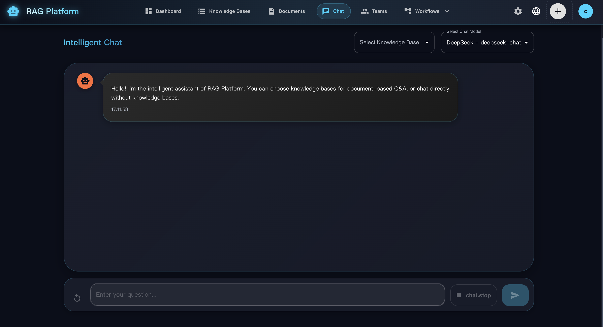

# RAG Platform (ragJ_platform)

English | [Chinese](README.zh-CN.md)

An open-source, high-performance RAG (Retrieval-Augmented Generation) platform built with Python (FastAPI) and TypeScript (React), designed for document-based AI assistants.

## 🖼️ Demo & Screenshots

> Replace the files under `images/` with your latest screenshots before publishing.






## 🚀 Project Overview

This project aims to create a powerful RAG platform, inspired by systems like Dify, with a clean modular architecture: FastAPI for backend APIs and orchestration, and a modern React web UI for management and workflows.

### Core Features

-   🧠 **Intelligent Q&A**: Perform complex question-answering on your documents using a RAG pipeline.
-   📚 **Knowledge Base Management**: Easily create and manage distinct knowledge bases.
-   📄 **Multi-Format Document Support**: Upload and process various document formats (starting with `.txt` and `.md`).
-   🔌 **Flexible API**: A straightforward RESTful API for integration with any application.
-   🤖 **Multi-Model Support**: Supports DeepSeek, Qwen, and SiliconFlow APIs for different use cases.
-   ⚡ **High-Performance Backend**: FastAPI-based backend for asynchronous request handling.
-   🎨 **Modern Web Interface**: React-based frontend with Material-UI for intuitive management.
-   ⚙️ **Flexible Configuration**: Easy model switching and configuration management.
-   🌍 **Internationalization**: Support for Chinese and English language switching.

## 🏗️ System Architecture


## 🌐 Public API & Embedding

The platform exposes a simple public API (x-api-key) so you can validate workflows via chat and embed the assistant into any web page.

- Public endpoints (no login, require `x-api-key`):
  - `POST /api/v1/public/chat` — non-stream chat, request body is `ChatRequest`.
  - `POST /api/v1/public/chat/stream` — streaming chat (SSE), suitable for web embeds.
  - `POST /api/v1/public/workflows/{workflow_id}/run` — run a saved workflow (non-stream).
  - `POST /api/v1/public/workflows/{workflow_id}/run/stream` — run a saved workflow (SSE: started/progress/complete).
  - `GET /api/v1/public/workflows/{workflow_id}/io-schema` — infer workflow-level input/output schema for integration.
  - `POST /api/v1/public/workflows/{workflow_id}/execute` — legacy alias of `run` (kept for compatibility).

- Admin endpoints for API key management:
  - `POST /api/v1/admin/api-keys` — create a key (scopes: `chat`, `workflow`; optional `allowed_kb`, `allowed_workflow_id`).
  - `GET /api/v1/admin/api-keys` — list keys for your tenant.
  - `DELETE /api/v1/admin/api-keys/{id}` — revoke key.

### Workflow API examples

Run (non-stream):

```bash
curl -sS -X POST "https://your-host/api/v1/public/workflows/<workflow_id>/run" \
  -H "Content-Type: application/json" \
  -H "x-api-key: YOUR_KEY" \
  -d '{"input_data":{"text":"hello"}}'
```

Run (stream, SSE):

```bash
curl -N -X POST "https://your-host/api/v1/public/workflows/<workflow_id>/run/stream" \
  -H "Content-Type: application/json" \
  -H "x-api-key: YOUR_KEY" \
  -d '{"input_data":{"text":"hello"},"debug":false}'
```

### Embedding example

Option 1: iframe

```html
<iframe
  src="https://your-host/embed.html?api_key=YOUR_KEY&kb=your_kb&api_base=https://your-host"
  style="width: 100%; height: 560px; border: 1px solid #eee; border-radius: 8px"
></iframe>
```

Option 2: fetch from your own widget

```js
const res = await fetch('https://your-host/api/v1/public/chat/stream', {
  method: 'POST',
  headers: { 'Content-Type': 'application/json', 'x-api-key': 'YOUR_KEY' },
  body: JSON.stringify({ message: 'Hello', knowledge_base_id: 'your_kb' }),
});
// Read SSE chunks from res.body and render progressively.
```

Notes:
- Public chat supports RAG with `knowledge_base_id` and will route to your tenant’s KB automatically.
- Public workflow execution supports cross-tenant **public workflows**: an API key from tenant A can run a workflow owned by tenant B if that workflow is marked `is_public=true`.
- If you want to restrict cross-tenant workflow execution, bind the API key with `allowed_workflow_id`.
- Runtime injects execution context (`tenant_id` is set to the workflow owner tenant; `user_id=0`) for isolation.

The system is designed with a clean separation of concerns:

-   **FastAPI Backend (Python)**: Handles all API requests, business logic, and orchestration.
-   **React Frontend (TypeScript)**: Modern web interface with Material-UI components.
-   **Milvus**: Acts as the vector database for storing and retrieving document embeddings.
-   **Elasticsearch**: Provides full-text search capabilities for hybrid retrieval.
-   **Multi-Model Support**: Integrates with DeepSeek, Qwen, and SiliconFlow APIs.

## 📦 Quick Start

You can start the whole stack with Docker Compose (recommended), or run backend/frontend locally for development.

### Prerequisites

-   Python 3.9+
-   Docker + Docker Compose (recommended for one-command startup)
-   An available Milvus instance.
-   A Dashscope API Key for the Qwen models.

### Docker Compose (Recommended)

Bring up backend + frontend + MySQL + Milvus + Elasticsearch:

```bash
# (Optional but recommended) create root .env for API keys and overrides
cp backend/.env.example .env

docker compose -f docker-compose.dev.yml up -d --build
```

Access:
- Frontend: `http://localhost:5173`
- Backend API docs: `http://localhost:8000/api/v1/docs`

Useful commands:

```bash
docker compose -f docker-compose.dev.yml logs -f backend
docker compose -f docker-compose.dev.yml down
# reset volumes if you hit init errors (THIS DELETES DB/VECTOR DATA)
docker compose -f docker-compose.dev.yml down -v
```

### Local Setup

1.  **Clone the Repository**
    ```bash
    git clone <your-repo-url>
    cd ragJ_platform/backend
    ```

2.  **Configure Environment Variables**
    Create a `.env` file in the `backend/` directory by copying the example:
    ```bash
    cp .env.example .env
    ```
    Now, edit the `.env` file and set your credentials:
    ```
    # backend/.env

    # Your Dashscope API Key for Qwen models
    DASHSCOPE_API_KEY="your_sk_key_here"

    # Connection details for your Milvus instance
    MILVUS_HOST="localhost"
    MILVUS_PORT="19530"
    ```

3.  **Install Dependencies**
    It is highly recommended to use a virtual environment.
    ```bash
    python3 -m venv venv
    source venv/bin/activate
    pip install --upgrade pip
    pip install -r requirements.txt
    ```

4.  **Run the Server**
    ```bash
    uvicorn app.main:app --reload --host 0.0.0.0 --port 8000
    ```

5.  **Access the API**
    Once the server is running, you can access the interactive API documentation at:
    [http://localhost:8000/docs](http://localhost:8000/docs)

### Frontend Setup

The platform includes a modern React-based web interface for easy management.

1.  **Navigate to Frontend Directory**
    ```bash
    cd frontend
    ```

2.  **Install Dependencies**
    ```bash
    npm install
    ```

3.  **Start Development Server**
    ```bash
    npm run dev
    ```

4.  **Access Web Interface**
    The frontend will be available at:
    [http://localhost:5173](http://localhost:5173)

### Web Interface Features

-   📊 **Dashboard**: System overview and statistics
-   📚 **Knowledge Base Management**: Create, delete, and manage knowledge bases
-   💬 **Intelligent Chat**: Interactive chat interface with knowledge base selection
-   ⚙️ **Model Configuration**: Easy setup for DeepSeek, Qwen, and SiliconFlow APIs
-   📝 **Document Management**: Upload and manage documents (coming soon)
-   🌍 **Language Support**: Switch between Chinese and English interface

### Maintenance

-   Elasticsearch index mapping updated to include `tenant_id`/`user_id` (integer) and `document_name`/`knowledge_base` (keyword) fields. For existing knowledge bases created with older mappings, you can rebuild the ES index:

  - `POST /api/v1/knowledge-bases/{kb_name}/maintenance/rebuild-es-index` — recreate ES index only
  - `POST /api/v1/knowledge-bases/{kb_name}/maintenance/rebuild-es-index?reindex=true` — recreate and reindex documents (re-parses source files; chunking may differ from Milvus)

### Upload Processing Options

-   `UPLOAD_DIR` controls where uploaded files are stored (default `/tmp/uploads`).
-   Set `USE_CELERY=true` and configure `CELERY_BROKER_URL`/`CELERY_RESULT_BACKEND` to offload document processing to a Celery worker instead of the API process.

## 🔧 API Usage Guide

Here is how to use the core RAG pipeline via the API.

### Step 1: Create a Knowledge Base

First, create a new knowledge base. This corresponds to a new "collection" in Milvus.

```bash
curl -X 'POST' \
  'http://localhost:8000/api/v1/knowledge-bases/' \
  -H 'accept: application/json' \
  -H 'Content-Type: application/json' \
  -d '{
    "name": "my_first_kb",
    "description": "A knowledge base for testing."
  }'
```

A successful response will confirm that the knowledge base was created.

### Step 2: Upload a Document

Next, upload a document (`.txt` or `.md`) to your new knowledge base. The system will process it in the background (chunking, embedding, and indexing).

**Note:** Make sure you have a file named `sample.txt` in your current directory.

```bash
curl -X 'POST' \
  'http://localhost:8000/api/v1/knowledge-bases/my_first_kb/documents/' \
  -H 'accept: application/json' \
  -F 'file=@sample.txt;type=text/plain'
```

The API will respond immediately, confirming that the file has been accepted for processing.

### Step 3: Chat with Your Knowledge Base

Once the document has been processed, you can start asking questions. The system will retrieve relevant context from your documents to generate an answer.

```bash
curl -X 'POST' \
  'http://localhost:8000/api/v1/chat/' \
  -H 'accept: application/json' \
  -H 'Content-Type: application/json' \
  -d '{
    "message": "What is this document about?",
    "knowledge_base_id": "my_first_kb",
    "model": "qwen-turbo"
  }'
```

The response will contain the AI's answer, generated based on the content of the document you uploaded.

## 🤖 Model Configuration

The platform supports multiple AI model providers for different use cases:

### Supported Providers

#### DeepSeek
- **Best for**: Code generation, technical documentation
- **Models**: `deepseek-chat`, `deepseek-coder`
- **API**: https://api.deepseek.com/v1

#### Qwen (Tongyi Qianwen)
- **Best for**: Chinese language tasks, comprehensive AI capabilities
- **Models**: `qwen-turbo`, `qwen-plus`, `qwen-max`
- **API**: https://dashscope.aliyuncs.com/compatible-mode/v1

#### SiliconFlow
- **Best for**: Cost-effective embedding and reranking
- **Models**: Various open-source models including BGE series
- **API**: https://api.siliconflow.cn/v1

### Configuration Presets

The web interface provides three pre-configured setups:

1. **Economic Configuration**
   - Chat: DeepSeek
   - Embedding: SiliconFlow BGE
   - Rerank: SiliconFlow BGE

2. **Premium Configuration**
   - Chat: Qwen Max
   - Embedding: Qwen Embedding
   - Rerank: Qwen Rerank

3. **Chinese-Optimized Configuration**
   - Chat: Qwen Plus
   - Embedding: SiliconFlow BGE Chinese
   - Rerank: SiliconFlow BGE Reranker

### API Key Setup

To configure your models:

1. Visit the **Settings** page in the web interface
2. Choose a preset or configure manually
3. Add your API keys for each provider
4. Test the connections
5. Save the configuration

### Language Support

The web interface supports both Chinese and English:

- **Language Switching**: Click the language icon (top-right) to switch between Chinese and English
- **Auto Detection**: The system automatically detects your browser language preference
- **Persistent Settings**: Your selection is cached in browser `localStorage` and remembered across sessions

#### Supported Languages

- **Chinese**: Full interface translation for Chinese users
- **English**: Complete English interface for international users

All interface elements, including:
- Navigation menus
- Form labels and buttons
- Error messages and notifications
- Help text and descriptions
- Model configuration options

Are fully translated and localized for both languages.

## 📚 Modules

### 1. Document Processing
- **Formats**: PDF, DOCX, TXT, Markdown, HTML
- **Capabilities**: text extraction, structure parsing, metadata extraction
- **Chunking**: smart chunking, fixed-length, semantic splitting

### 2. Vectorization
- **Embedding models**: OpenAI, Hugging Face, local models
- **Vector store**: indexing and retrieval optimizations
- **Hybrid retrieval**: semantic + keyword search

### 3. Q&A
- **RAG pipeline**: retrieve + generate
- **Model options**: GPT-class models, Claude-class models, open-source LLMs
- **Conversation context**: multi-turn chat support

### 4. LangGraph Workflows
- **Workflow builder**: graph-based agent/workflow design
- **State management**: persistent execution state and checkpoints
- **Multi-agent collaboration**: agents can coordinate and communicate
- **Conditional routing**: route by conditions during execution

### 5. Knowledge Base Management
- **Organization**: hierarchical KB management
- **Access control**: fine-grained permissions
- **Versioning**: document version tracking

## ✅ Public Repo Checklist (before making GitHub public)

- Secrets: ensure no API keys/tokens are committed; use `backend/.env.example` as the template.
- Links: replace placeholder links like `https://github.com/your-org/...` and any non-existent domains/emails.
- Images: replace/update screenshots under `images/`.
- License: keep README’s license statement consistent with `LICENSE`.

## 🔒 Security

### API authentication
```python
# Generate an API key
from backend.app.core.security import generate_api_key

api_key = generate_api_key(user_id="user_123")
```

### Permissions
```yaml
# config/permissions.yml
roles:
  admin:
    - knowledge_base:*
    - document:*
    - user:*
  user:
    - knowledge_base:read
    - document:upload
    - chat:query
```

## 🚀 Deployment

### Production environment variables

```bash
# .env.production
DATABASE_URL=postgresql://user:pass@db:5432/ragj_platform
REDIS_URL=redis://redis:6379/0
QDRANT_URL=http://qdrant:6333
MINIO_ENDPOINT=minio:9000

# LLM configuration
OPENAI_API_KEY=your_openai_key
OPENAI_BASE_URL=https://api.openai.com/v1

# Security configuration
SECRET_KEY=your_super_secret_key
JWT_ALGORITHM=HS256
ACCESS_TOKEN_EXPIRE_MINUTES=30

# Service configuration
API_V1_STR=/api/v1
PROJECT_NAME=RAG Platform
DEBUG=false
```

### Monitoring

```yaml
# docker-compose.monitoring.yml
version: '3.8'
services:
  prometheus:
    image: prom/prometheus
    ports:
      - "9090:9090"
  
  grafana:
    image: grafana/grafana
    ports:
      - "3001:3000"
```

## 📈 Performance

### Backend optimizations
- Async/concurrent processing (FastAPI + background tasks)
- Batch embedding and request coalescing (lower embedding cost)
- Tune chunking and retrieval parameters (quality vs latency)

### Database optimizations
```sql
-- Vector retrieval index
CREATE INDEX idx_embeddings_vector ON document_chunks 
USING ivfflat (embedding vector_cosine_ops) 
WITH (lists = 100);

-- Metadata query indexes
CREATE INDEX idx_documents_kb_id ON documents(knowledge_base_id);
CREATE INDEX idx_chunks_doc_id ON document_chunks(document_id);
```

### Caching
- Redis for hot queries
- Embedding cache
- Document processing result cache

## 🛠️ Development

### Local development

```bash
# Install dev dependencies
pip install -r requirements-dev.txt

# Formatting
black backend/

# Type checking
mypy backend/app/

# Tests
pytest backend/tests/
```

### API docs

```bash
# After starting the backend, visit:
http://localhost:8000/docs         # Swagger UI
http://localhost:8000/redoc        # ReDoc
http://localhost:8000/openapi.json # OpenAPI spec
```

## 🤝 Contributing

1. Fork the repo
2. Create a feature branch (`git checkout -b feature/AmazingFeature`)
3. Commit changes (`git commit -m 'Add some AmazingFeature'`)
4. Push the branch (`git push origin feature/AmazingFeature`)
5. Open a Pull Request

## 📄 License

This project is licensed under the MIT License — see [LICENSE](LICENSE).

## 🆘 Support

- Discussions: [GitHub Discussions](https://github.com/chongliujia/ragJ_platform/discussions)
- Issues: [GitHub Issues](https://github.com/chongliujia/ragJ_platform/issues)
- Docs: `docs/`


---

**Note**: This is a baseline implementation suitable for learning and small deployments. For production use, harden security and tune performance for your workload.
