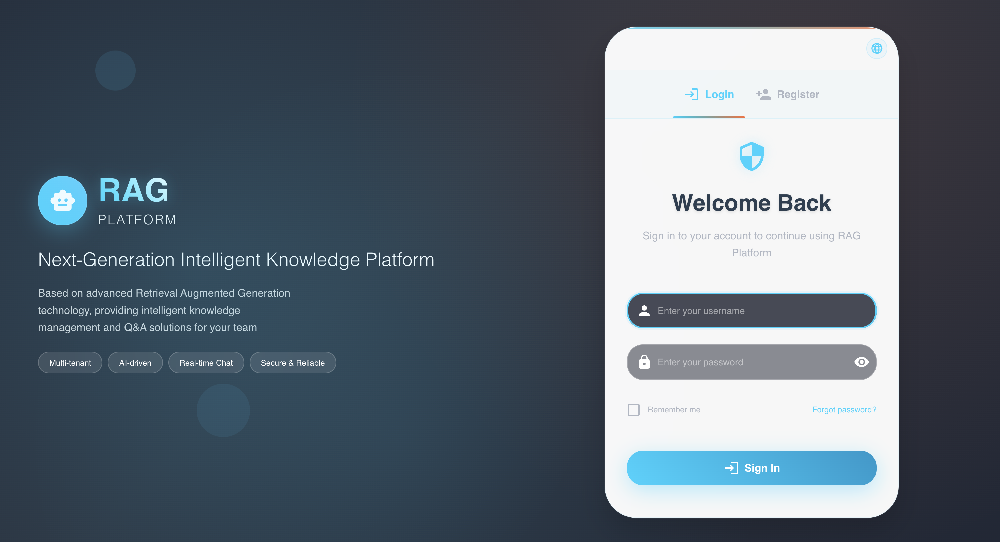

# RAG Platform (ragJ_platform)

[English](README.md) | 中文

一个开源的高性能 RAG（Retrieval-Augmented Generation，检索增强生成）平台，基于 Python（FastAPI）+ TypeScript（React），用于构建面向文档的 AI 助手与工作流。

## 🖼️ 演示与截图

> 仓库公开前，请确认截图中不包含 API Key、内部域名/URL、客户数据等敏感信息。




## 🚀 项目概览

本项目提供可自托管的 RAG 能力与可视化管理界面：后端使用 FastAPI 负责 API、业务编排与权限隔离；前端提供知识库管理、文档上传、对话与工作流编辑等能力。

### 核心特性

- 🧠 **智能问答**：基于知识库的 RAG 问答。
- 📚 **知识库管理**：创建、管理多个知识库。
- 📄 **多格式文档**：上传并处理多种文档格式（以项目当前实现为准）。
- 🔌 **开放 API**：RESTful API 方便接入任意应用。
- 🤖 **多模型支持**：支持 DeepSeek / Qwen / SiliconFlow 等。
- ⚡ **高性能后端**：FastAPI 异步请求处理。
- 🎨 **现代 Web UI**：React + Material-UI 管理后台与工作流编辑。
- 🌍 **中英界面**：前端支持中文/英文切换。

## 🌐 Public API & Embedding（对外API与嵌入）

平台提供对外 API（通过 `x-api-key`）以便测试对话/工作流，并支持将助手嵌入到任意网页中。

- 公共端点（无需登录，但需要 `x-api-key`）：
  - `POST /api/v1/public/chat` — 非流式对话（`ChatRequest`）。
  - `POST /api/v1/public/chat/stream` — SSE 流式对话（适用于 Web 嵌入）。
  - `POST /api/v1/public/workflows/{workflow_id}/run` — 运行工作流（非流式）。
  - `POST /api/v1/public/workflows/{workflow_id}/run/stream` — 运行工作流（SSE）。
  - `GET /api/v1/public/workflows/{workflow_id}/io-schema` — 推断工作流输入/输出 Schema。
  - `POST /api/v1/public/workflows/{workflow_id}/execute` — `run` 的兼容别名。

- 管理端点（API Key 管理）：
  - `POST /api/v1/admin/api-keys` — 创建 Key（scope：`chat`、`workflow`；可选 `allowed_kb`、`allowed_workflow_id`）。
  - `GET /api/v1/admin/api-keys` — 列表。
  - `DELETE /api/v1/admin/api-keys/{id}` — 吊销。

## 📦 快速开始

推荐使用 Docker Compose 一键启动全套依赖；也支持本地分别启动后端/前端用于开发。

### 方式A：Docker Compose（推荐）

一键启动：后端 + 前端 + MySQL + Milvus + Elasticsearch

```bash
#（可选但推荐）在仓库根目录创建 .env，用于配置 API Key 等
cp backend/.env.example .env

docker compose -f docker-compose.dev.yml up -d --build
```

访问：
- 前端：`http://localhost:5173`
- 后端 API 文档：`http://localhost:8000/api/v1/docs`

常用命令：

```bash
docker compose -f docker-compose.dev.yml logs -f backend
docker compose -f docker-compose.dev.yml down
# 需要清理数据卷时（会删除数据库/向量数据）
docker compose -f docker-compose.dev.yml down -v
```

### 方式B：本地开发启动

后端开发启动：

```bash
git clone <your-repo-url>
cd ragJ_platform/backend
cp .env.example .env
python3 -m venv venv
source venv/bin/activate
pip install --upgrade pip
pip install -r requirements.txt
uvicorn app.main:app --reload --host 0.0.0.0 --port 8000
```

前端开发启动：

```bash
cd ragJ_platform/frontend
npm install
npm run dev
```

## ✅ 仓库公开前检查清单

- Secrets：确认未提交任何 API Key/Token；用 `backend/.env.example` 作为模板。
- 链接：将 README 中 `https://github.com/your-org/...` 等占位链接替换为真实仓库地址。
- 截图：更新 `images/` 下截图，并去除敏感信息。
- 许可证：README 的许可证描述与 `LICENSE` 保持一致。

## 📄 许可证

本项目采用 MIT 许可证 - 查看 [LICENSE](LICENSE) 文件了解详情。
