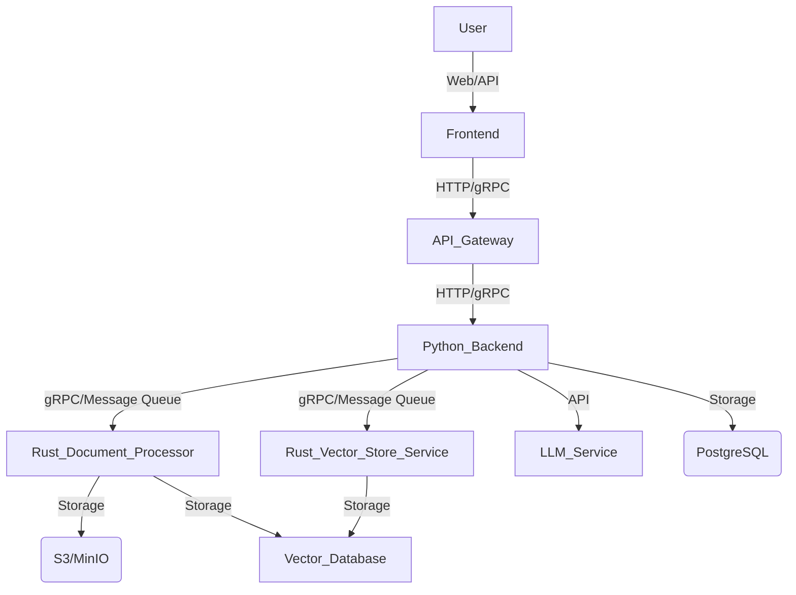

# 系统架构设计

## 1. 总体架构

我们将采用微服务架构，将系统的不同功能模块解耦，以便于独立开发、部署和扩展。Rust 将主要负责性能敏感的核心任务，如文档处理和向量化，而 Python 将负责更上层的业务逻辑、LLM 编排和用户界面。

## 2. 各组件职责

*   **前端 (Frontend):** 提供用户界面，用于知识库管理、RAG 应用配置和交互。可以使用 React, Vue 或 Angular 等框架。
*   **API 网关 (API Gateway):** 统一入口，负责请求路由、认证、限流等。可以使用 Nginx, Kong 或 API Gateway 服务。
*   **Python 后端 (Python Backend):**
    *   **核心业务逻辑:** 用户管理、知识库管理（元数据）、RAG 应用编排、权限控制。
    *   **LLM 交互:** 调用大型语言模型服务，进行问答、生成等。
    *   **任务调度:** 协调文档处理和向量化任务。
    *   **技术栈:** FastAPI/Django, Celery (异步任务), SQLAlchemy (ORM)。
*   **Rust 文档处理器 (Rust Document Processor):**
    *   **文档解析:** 高效解析各种格式的文档（PDF, DOCX, TXT, Markdown 等），提取文本内容。
    *   **文本分块 (Chunking):** 根据预设策略（如固定大小、语义分割）对文本进行分块。
    *   **文本清洗:** 去除噪音、标准化文本。
    *   **嵌入生成:** 调用嵌入模型（可能是通过 gRPC 或 FFI 与 Python 侧的模型服务交互，或直接集成 Rust 库）生成文本块的向量嵌入。
    *   **技术栈:** Rust, `pdf-rs`, `docx-rs`, `text-splitter` (或自定义分块逻辑), `candle`/`tch-rs` (如果直接在 Rust 中进行嵌入生成)。
*   **Rust 向量存储服务 (Rust Vector Store Service):**
    *   **向量存储与检索:** 负责与向量数据库交互，进行向量的存储、索引和高效检索。
    *   **性能优化:** 利用 Rust 的并发能力和内存管理优势，优化向量检索性能。
    *   **技术栈:** Rust, `qdrant-client`/`milvus-client`/`pgvector` (根据选择的向量数据库)。
*   **LLM 服务 (LLM Service):** 独立部署的大型语言模型服务，可以通过 API 调用。可以是 OpenAI API, Hugging Face Inference API, 或自部署的 LLM。
*   **文档存储 (Document Storage):** 存储原始文档文件。可以使用 S3 兼容的对象存储服务（如 MinIO, AWS S3）。
*   **向量数据库 (Vector Database):** 存储文本块的向量嵌入，支持高效的相似性搜索。例如 Qdrant, Milvus, Weaviate, 或 Pgvector (如果使用 PostgreSQL)。
*   **关系型数据库 (Relational Database):** 存储用户数据、知识库元数据、任务状态等结构化数据。例如 PostgreSQL, MySQL。

## 3. 技术栈选择

*   **后端语言:** Python (业务逻辑, LLM 编排), Rust (高性能文档处理, 向量操作)
*   **Web 框架 (Python):** FastAPI (高性能, 异步支持)
*   **异步任务队列:** Celery (Python)
*   **ORM (Python):** SQLAlchemy
*   **文档解析/处理 (Rust):** `pdf-rs`, `docx-rs`, `markdown-rs` 等库，或自定义实现。
*   **向量嵌入 (Rust/Python):** 如果在 Rust 中处理，考虑 `candle` 或 `tch-rs`。如果通过服务调用，则 Python 侧负责。
*   **RPC 框架:** gRPC (Python 和 Rust 之间的高效通信)
*   **消息队列:** Kafka/RabbitMQ (用于异步任务和解耦)
*   **对象存储:** MinIO/AWS S3
*   **向量数据库:** Qdrant/Milvus/Weaviate (根据具体需求和性能考量选择)
*   **关系型数据库:** PostgreSQL
*   **容器化:** Docker, Kubernetes (用于部署和管理)
*   **前端框架:** React/Vue/Angular

## 4. Rust 与 Python 的集成方式

*   **gRPC:** 推荐的主要通信方式。Python 后端作为客户端调用 Rust 服务，Rust 服务作为 gRPC 服务器提供文档处理和向量操作接口。这提供了高性能、类型安全的跨语言通信。
*   **消息队列:** 对于耗时的文档处理任务，Python 可以将任务信息发送到消息队列，Rust 文档处理器订阅队列并异步处理。处理完成后，结果可以写入数据库或通过另一个消息队列通知 Python 后端。
*   **FFI (Foreign Function Interface):** 对于非常紧密的集成，可以将 Rust 编译为 Python 模块，通过 `PyO3` 等库直接在 Python 中调用 Rust 函数。这在需要极致性能且避免网络开销的场景下非常有用，但会增加部署复杂性。

考虑到您的需求，Rust 将在文档解析、分块和向量化（如果直接在 Rust 中进行）方面发挥关键作用，显著提升这部分流程的性能。

