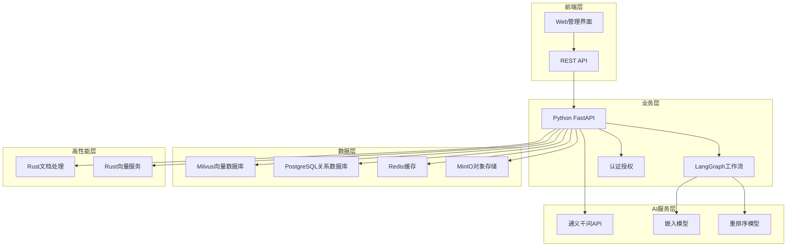

# RAG Platform 项目管理文档

## 📋 项目概览

**项目名称**: RAG Platform (ragJ_platform)  
**项目类型**: 企业级RAG平台  
**开始时间**: 2024年12月  
**项目状态**: 🟢 进行中  
**当前版本**: v0.1.0 (第一期基础版本)

### 项目愿景
构建一个基于Rust+Python+LangGraph的高性能RAG平台，提供企业级文档智能问答和AI助手服务，支持自定义工作流和多种AI模型集成。

### 核心目标
- 🚀 **高性能**: 使用Rust处理文档解析和向量操作
- 🧠 **智能化**: 集成LangGraph实现复杂工作流
- 🔌 **易集成**: 提供标准API供网站和应用调用
- 📈 **可扩展**: 支持多种向量数据库和LLM模型
- 🏢 **企业级**: 支持权限管理、监控告警等企业功能

## 🗺️ 项目里程碑规划

### 第一期：基础框架搭建 ✅ (已完成)
**时间**: 2024年12月  
**目标**: 搭建基础架构，实现核心API接口  
**状态**: ✅ 完成

### 第二期：核心RAG流程实现 ✅ (已完成)
**时间**: 2025年1月  
**目标**: 实现端到端的RAG流程，包括知识库管理、文档索引和问答功能。
**详细计划**: [v0.2.0 - 第二期计划](./milestones/v0.2.0_Phase_II_Plan.md)  
**状态**: ✅ 完成

### 第三期：产品可用化 & 体验优化 🚧 (进行中)
**时间**: 2025年2月 (预估)
**目标**: 开发简易Web管理后台、支持多格式文档、优化检索与生成效果、并建立标准化部署与CI流程。
**详细计划**: [v0.3.0 - 第三期计划](./milestones/v0.3.0_Phase_III_Plan.md)
**状态**: 🚧 进行中

### 第四期：高级功能与Rust集成 📅 (待规划)
**时间**: 2025年3月 (预估)
**目标**: 集成Rust高性能服务、实现LangGraph高级工作流。
**状态**: 📅 待开始

### 第五期：企业级功能 📅 (待规划)
**时间**: 2025年4月  
**目标**: 权限管理、监控告警、多租户  
**状态**: 📅 待开始

## 📊 技术架构概览

## 📈 功能模块进度

### 核心功能模块

| 模块 | 状态 | 完成度 | 负责人 | 备注 |
|------|------|--------|--------|------|
| 基础架构 | ✅ | 100% | - | FastAPI + 项目结构 |
| 聊天接口 | ✅ | 100% | - | 已集成真实LLM并支持RAG |
| 文件上传 | ✅ | 100% | - | 支持后台处理 |
| 知识库管理 | ✅ | 100% | - | 已集成Milvus向量数据库 |
| 文档管理 | ✅ | 100% | - | 已实现文档处理与索引 |
| 智能体工作流 | ✅ | 30% | - | 框架搭建，待LangGraph集成 |
| 认证系统 | ✅ | 40% | - | 简单认证，待完善权限 |
| API文档 | ✅ | 100% | - | Swagger UI完整 |

### AI集成模块

| 模块 | 状态 | 完成度 | 预计完成时间 | 备注 |
|------|------|--------|-------------|------|
| 通义千问聊天 | ✅ | 100% | 第二期 | API调用和响应处理 |
| 通义千问嵌入 | ✅ | 100% | 第二期 | 文档向量化 |
| 通义千问重排序 | 📅 | 0% | 第三期 | 检索结果重排序 |
| Milvus集成 | ✅ | 100% | 第二期 | 向量存储和检索 |
| RAG流程 | ✅ | 100% | 第二期 | 完整的检索增强生成 |

### 高性能模块

| 模块 | 状态 | 完成度 | 预计完成时间 | 备注 |
|------|------|--------|-------------|------|
| Rust文档处理 | 📅 | 0% | 第四期 | PDF/DOCX解析和分块 |
| Rust向量服务 | 📅 | 0% | 第四期 | 高性能向量操作 |
| gRPC通信 | 📅 | 0% | 第四期 | Python-Rust服务通信 |
| 性能优化 | 📅 | 0% | 第三期 | 并发处理和缓存 |

### 企业级功能

| 模块 | 状态 | 完成度 | 预计完成时间 | 备注 |
|------|------|--------|-------------|------|
| 用户权限管理 | 📅 | 0% | 第五期 | RBAC权限控制 |
| 多租户支持 | 📅 | 0% | 第五期 | 租户隔离 |
| 监控告警 | 📅 | 0% | 第五期 | Prometheus + Grafana |
| 日志审计 | 📅 | 0% | 第五期 | 操作日志记录 |
| Web管理界面 | 📅 | 0% | 第三期 | React管理后台 |

## 🔧 技术栈选择

### 已确定技术栈
- **后端框架**: FastAPI (Python)
- **AI工作流**: LangGraph
- **向量数据库**: Milvus (主要), Qdrant (备用)
- **LLM服务**: 通义千问 API
- **高性能服务**: Rust
- **关系数据库**: PostgreSQL
- **缓存**: Redis
- **对象存储**: MinIO
- **容器化**: Docker

### 待确定技术栈
- **前端框架**: React/Vue (待选择)
- **消息队列**: Kafka/RabbitMQ (待选择)
- **监控系统**: Prometheus + Grafana
- **日志系统**: ELK/Loki (待选择)

## 📋 开发规范

### 代码规范
- **Python**: 使用 Black 格式化，遵循 PEP 8
- **Rust**: 使用 rustfmt 格式化
- **类型提示**: Python 代码必须包含类型提示
- **注释语言**: 所有代码注释统一使用英文编写
- **文档**: 所有公开API必须包含完整文档
- **函数文档**: 函数和类的文档字符串使用英文编写

### Git 工作流
- **分支策略**: Git Flow
- **提交规范**: Conventional Commits
- **代码审查**: 所有代码必须经过review

### 测试规范
- **单元测试**: 覆盖率 > 80%
- **集成测试**: 核心API必须有集成测试
- **性能测试**: 关键接口必须有性能基准

## 🎯 关键指标 (KPI)

### 性能指标
- **API响应时间**: < 500ms (P95)
- **文档处理速度**: > 100页/秒
- **向量检索延迟**: < 100ms
- **系统可用性**: > 99.9%

### 用户体验指标
- **聊天响应时间**: < 3秒
- **文件上传成功率**: > 99%
- **API错误率**: < 1%

### 开发效率指标
- **新功能交付**: 每月至少1个主要功能
- **Bug修复时间**: 平均 < 24小时
- **代码质量**: 无重大安全漏洞

## 📞 项目沟通

### 定期会议
- **每周进度**: 每周五总结本周进度和下周计划
- **里程碑评审**: 每期完成后的回顾和下期规划
- **技术讨论**: 重大技术决策的讨论会议

### 文档管理
- **进度报告**: 每期完成后编写进度报告
- **技术文档**: 重要功能的技术设计文档
- **问题跟踪**: 使用 GitHub Issues 跟踪问题

## 🚨 风险管理

### 技术风险
- **AI API限制**: 通义千问API的调用限制和成本
- **性能瓶颈**: 大量并发时的性能问题
- **数据安全**: 用户数据的安全保护

### 项目风险
- **进度延期**: 技术难度超出预期
- **需求变更**: 用户需求的变化
- **资源不足**: 开发资源的限制

### 缓解措施
- **技术预研**: 重要技术提前验证
- **备选方案**: 关键技术准备备选方案
- **分期交付**: 采用敏捷开发方式
- **持续集成**: 自动化测试和部署

---

## 📝 更新记录

| 日期 | 版本 | 更新内容 | 更新人 |
|------|------|----------|--------|
| 2024-12-XX | v1.0 | 初始创建项目管理文档 | - |
| 2025-07-06 | v2.0 | 完成第二期RAG核心流程，启动第三期 | - |

---

**注**: 此文档会随着项目进展持续更新，请定期查看最新版本。 