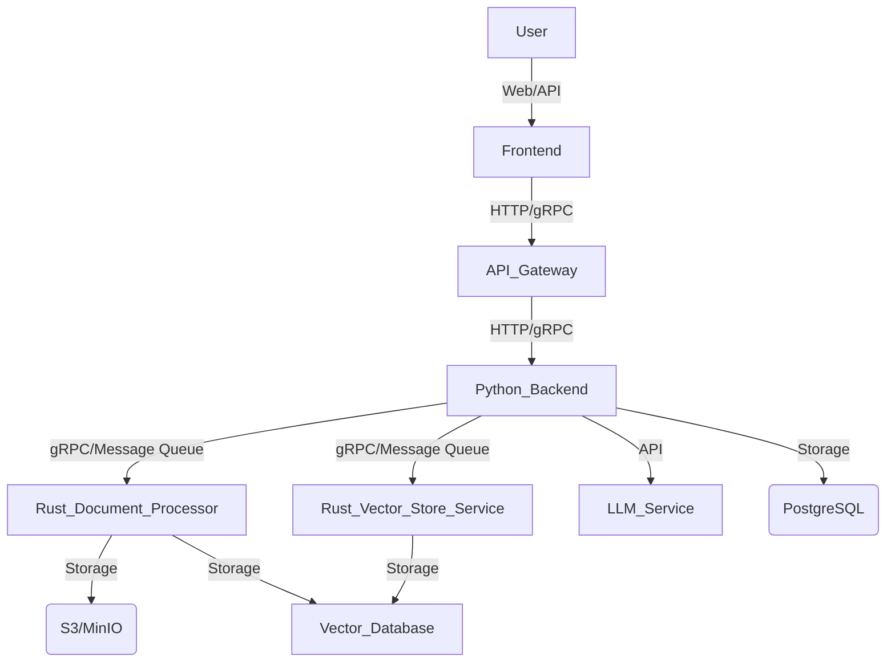

# RAGFlow/Dify 类平台详细设计文档

## 1. 引言

本文档旨在为构建一个基于 Rust 和 Python 的 RAGFlow/Dify 类平台提供详细的架构设计、技术栈选择和目录结构规划。该平台将专注于解决现有知识库构建中，特别是文档分块解析效率低下的问题，利用 Rust 的高性能特性进行优化。

## 2. 现有平台架构概述

### 2.1 RAGFlow 架构概述


RAGFlow 是一个基于深度文档理解的开源 RAG（检索增强生成）引擎。其架构旨在支持高级功能并确保可扩展性和效率，主要分为以下几个阶段：

1.  **信息提取 (Information Extraction):** 利用深度文档理解模型处理非结构化数据并提取相关信息。
2.  **文档预处理 (Document Preprocessing):** 涉及知识图谱构建、文档聚类和领域特定嵌入，为索引准备数据。
3.  **索引 (Indexing):** 采用混合搜索技术，包括全文搜索和向量搜索，以创建处理后数据的综合索引。
4.  **检索 (Retrieval):** 实现粗粒度和细粒度排名机制，以及基于用户意图识别的查询重写，以检索最相关的信息。

每个阶段都围绕着与数据库协同工作的 AI 模型构建，以确保最终答案的有效性。

### 2.2 Dify 架构概述

Dify 是一个用于构建大型语言模型（LLM）应用程序的开源平台，它将后端即服务和 LLMOps 相结合，以简化生成式 AI 的开发过程。Dify 的核心架构经过重新设计，采用了更模块化的方法，每个模块都可以独立运行，从而增强了灵活性和可扩展性。其最新的 Beehive 架构旨在使每个部分既独立又协作，同时保持灵活性和可扩展性，使整个系统更易于维护和升级。

Beehive 架构包括构建 LLM 应用程序所需的所有关键技术，例如：

*   支持多种模型
*   易于使用的提示编排界面
*   一流的 RAG 引擎
*   灵活的 Agent 框架
*   一套直接的接口和 API

未来，Dify 计划进一步模块化更多功能，以提高其灵活性和增长能力，包括：

*   **RAG 引擎组件模块化:** 将 RAG 引擎分解为更小的部分，如 ETL、嵌入、索引构建和数据召回，允许开发人员选择和定制工具、模型和策略。
*   **添加更多工具:** 支持符合 OpenAPI 规范 API 标准的工具和 OpenAI 插件标准的工具。
*   **更灵活的工作流设置:** 允许开发人员根据自己的业务流程和需求调整工作流。

**模型运行时 (Model Runtime):**

Dify 推出了模型运行时服务模块，旨在简化模型的集成并允许开发人员灵活设置模型提供商。它提供统一的接口来访问不同类型的模型，通过 YAML 进行简化配置，并支持后端定义和设置模型，无需前端更改，从而实现动态添加模型。

## 3. 系统架构设计


## 3.1 总体架构

我们将采用微服务架构，将系统的不同功能模块解耦，以便于独立开发、部署和扩展。Rust 将主要负责性能敏感的核心任务，如文档处理和向量化，而 Python 将负责更上层的业务逻辑、LLM 编排和用户界面。



## 3.2 各组件职责

*   **前端 (Frontend):** 提供用户界面，用于知识库管理、RAG 应用配置和交互。可以使用 React, Vue 或 Angular 等框架。
*   **API 网关 (API Gateway):** 统一入口，负责请求路由、认证、限流等。可以使用 Nginx, Kong 或 API Gateway 服务。
*   **Python 后端 (Python Backend):**
    *   **核心业务逻辑:** 用户管理、知识库管理（元数据）、RAG 应用编排、权限控制。
    *   **LLM 交互:** 调用大型语言模型服务，进行问答、生成等。
    *   **任务调度:** 协调文档处理和向量化任务。
    *   **技术栈:** FastAPI/Django, Celery (异步任务), SQLAlchemy (ORM)。
*   **Rust 文档处理器 (Rust Document Processor):**
    *   **文档解析:** 高效解析各种格式的文档（PDF, DOCX, TXT, Markdown 等），提取文本内容。
    *   **文本分块 (Chunking):** 根据预设策略（如固定大小、语义分割）对文本进行分块。
    *   **文本清洗:** 去除噪音、标准化文本。
    *   **嵌入生成:** 调用嵌入模型（可能是通过 gRPC 或 FFI 与 Python 侧的模型服务交互，或直接集成 Rust 库）生成文本块的向量嵌入。
    *   **资源调度:** 负责协调和调度文档处理任务的计算资源，确保高效利用。
    *   **技术栈:** Rust, `pdf-rs`, `docx-rs`, `text-splitter` (或自定义分块逻辑), `candle`/`tch-rs` (如果直接在 Rust 中进行嵌入生成)。
*   **Rust 向量存储服务 (Rust Vector Store Service):**
    *   **向量存储与检索:** 负责与向量数据库交互，进行向量的存储、索引和高效检索。
    *   **性能优化:** 利用 Rust 的并发能力和内存管理优势，优化向量检索性能。
    *   **技术栈:** Rust, `qdrant-client`/`milvus-client`/`pgvector` (根据选择的向量数据库)。
*   **LLM 服务 (LLM Service):** 独立部署的大型语言模型服务，可以通过 API 调用。可以是 OpenAI API, Hugging Face Inference API, 或自部署的 LLM。
*   **文档存储 (Document Storage):** 存储原始文档文件。可以使用 S3 兼容的对象存储服务（如 MinIO, AWS S3）。
*   **向量数据库 (Vector Database):** 存储文本块的向量嵌入，支持高效的相似性搜索。例如 Milvus (推荐), Qdrant, Weaviate。
*   **关系型数据库 (Relational Database):** 存储用户数据、知识库元数据、任务状态等结构化数据。例如 PostgreSQL, MySQL。

## 3.3 技术栈选择

*   **后端语言:** Python (业务逻辑, LLM 编排), Rust (高性能文档处理, 向量操作)
*   **Web 框架 (Python):** FastAPI (高性能, 异步支持)
*   **异步任务队列:** Celery (Python)
*   **ORM (Python):** SQLAlchemy
*   **文档解析/处理 (Rust):** `pdf-rs`, `docx-rs`, `markdown-rs` 等库，或自定义实现。
*   **向量嵌入 (Rust/Python):** 如果在 Rust 中处理，考虑 `candle` 或 `tch-rs`。如果通过服务调用，则 Python 侧负责。
*   **RPC 框架:** gRPC (Python 和 Rust 之间的高效通信)
*   **消息队列:** Kafka/RabbitMQ (用于异步任务和解耦)
*   **对象存储:** MinIO/AWS S3
*   **向量数据库:** Qdrant/Milvus/Weaviate (根据具体需求和性能考量选择)
*   **关系型数据库:** PostgreSQL
*   **容器化:** Docker, Kubernetes (用于部署和管理)
*   **前端框架:** React/Vue/Angular

## 3.4 Rust 与 Python 的集成方式

*   **gRPC:** 推荐的主要通信方式。Python 后端作为客户端调用 Rust 服务，Rust 服务作为 gRPC 服务器提供文档处理、向量操作和智能体通信接口。这提供了高性能、类型安全的跨语言通信。
*   **消息队列:** 对于耗时的文档处理任务，Python 可以将任务信息发送到消息队列，Rust 文档处理器订阅队列并异步处理。处理完成后，结果可以写入数据库或通过另一个消息队列通知 Python 后端。
*   **FFI (Foreign Function Interface):** 对于非常紧密的集成，可以将 Rust 编译为 Python 模块，通过 `PyO3` 等库直接在 Python 中调用 Rust 函数。这在需要极致性能且避免网络开销的场景下非常有用，但会增加部署复杂性。

考虑到您的需求，Rust 将在文档解析、分块和向量化（如果直接在 Rust 中进行）方面发挥关键作用，显著提升这部分流程的性能。

## 4. 目录结构设计


我们将采用一个清晰的、模块化的目录结构，以便于团队协作、代码管理和未来的扩展。主要分为 `frontend`、`backend` (Python) 和 `rust_services` 三个顶级目录，以及 `docs` 和 `deploy` 等辅助目录。

```
rag_platform/
├── .git/
├── .github/              # GitHub Actions / CI/CD 配置
├── docs/                 # 项目文档，包括设计文档、API 文档、AI 辅助编程指南等
│   ├── architecture/
│   │   └── system_architecture_design.md
│   ├── development/
│   │   └── ai_programming_guide.md
│   └── README.md
├── frontend/             # 前端应用代码 (e.g., React/Vue)
│   ├── public/
│   ├── src/
│   │   ├── assets/
│   │   ├── components/
│   │   ├── pages/
│   │   ├── services/
│   │   └── App.js
│   ├── package.json
│   └── README.md
├── backend/              # Python 后端服务代码 (e.g., FastAPI)
│   ├── app/
│   │   ├── api/          # RESTful API 接口定义
│   │   ├── core/         # 核心业务逻辑、配置、依赖注入
│   │   ├── crud/         # 数据库操作 (Create, Read, Update, Delete)
│   │   ├── db/           # 数据库模型、迁移
│   │   ├── schemas/      # Pydantic 数据模型
│   │   ├── services/     # 业务服务层
│   │   ├── tasks/        # Celery 异步任务定义
│   │   └── main.py       # FastAPI 应用入口
│   ├── tests/
│   ├── Dockerfile
│   ├── requirements.txt
│   └── README.md
├── rust_services/         # Rust 核心服务代码
│   ├── document_processor/ # 文档处理服务
│   │   ├── src/
│   │   │   ├── lib.rs
│   │   │   └── main.rs
│   │   ├── Cargo.toml
│   │   └── Dockerfile
│   ├── vector_store_service/ # 向量存储服务
│   │   ├── src/
│   │   │   ├── lib.rs
│   │   │   └── main.rs
│   │   ├── Cargo.toml
│   │   └── Dockerfile
│   ├── common/           # Rust 公共库，例如 gRPC 定义、数据结构
│   │   ├── src/
│   │   │   └── lib.rs
│   │   └── Cargo.toml
│   └── README.md
├── deploy/               # 部署相关配置 (e.g., Docker Compose, Kubernetes)
│   ├── docker-compose.yml
│   ├── kubernetes/
│   └── README.md
├── .env.example          # 环境变量示例
├── README.md             # 项目总览 README
└── todo.md               # 任务清单
```

## 4.1 模块划分说明

### `docs/`

*   `architecture/`: 存放系统架构设计文档。
*   `development/`: 存放开发指南，特别是 AI 辅助编程指南。

### `frontend/`

*   标准的 Web 前端项目结构，`src` 目录下按功能划分组件、页面、服务等。

### `backend/` (Python)

*   `app/`: 存放 FastAPI 应用的核心代码。
    *   `api/`: 定义所有 RESTful API 路由和处理函数。
    *   `core/`: 存放应用配置、日志、异常处理、依赖注入等核心通用模块。
    *   `crud/`: 封装数据库的增删改查操作，与 `db/` 中的模型对应。
    *   `db/`: 定义 SQLAlchemy 模型、数据库连接和 Alembic 迁移脚本。
    *   `schemas/`: 定义 Pydantic 模型，用于请求验证和响应序列化。
    *   `services/`: 存放业务逻辑服务，协调 `crud` 和外部服务（如 Rust 服务、LLM 服务）的调用。
    *   `tasks/`: 定义 Celery 异步任务，例如触发文档处理任务。
    *   `main.py`: FastAPI 应用的入口文件。

### `rust_services/`

*   `document_processor/`: 负责文档的解析、分块、清洗和嵌入生成。
    *   `src/`: 存放 Rust 源代码，`lib.rs` 可能包含核心逻辑库，`main.rs` 包含 gRPC 服务器或消息队列消费者入口。
*   `vector_store_service/`: 负责与向量数据库的交互，提供向量存储和检索接口。
    *   `src/`: 存放 Rust 源代码，`lib.rs` 可能包含核心逻辑库，`main.rs` 包含 gRPC 服务器入口。
*   `common/`: 存放 Rust 服务之间共享的代码，例如 gRPC 的 `.proto` 文件编译生成的 Rust 结构体、通用的数据结构和工具函数。

### `deploy/`

*   存放 Docker Compose 文件、Kubernetes YAML 文件等，用于定义和部署整个系统的服务。


## 5. AI 辅助编程指南

本指南旨在帮助开发人员更好地利用 AI 工具（如大型语言模型）来辅助 Rust 和 Python 项目的开发。AI 辅助编程可以提高开发效率、减少错误并加速学习过程。

### 5.1 通用实践

*   **清晰的指令:** 向 AI 提供明确、具体的指令。例如，不要只说“写代码”，而是说“为 Rust 文档处理器编写一个函数，用于解析 PDF 文件并返回文本内容，使用 `pdf-rs` 库。”
*   **分步进行:** 对于复杂任务，将其分解为更小的、可管理的步骤，并逐一向 AI 寻求帮助。
*   **提供上下文:** 当请求 AI 帮助时，提供相关的代码片段、错误信息、文件结构或设计文档的链接。这有助于 AI 理解您的意图并生成更准确的响应。
*   **迭代和细化:** AI 生成的第一个结果可能不是完美的。根据需要进行迭代，提供反馈并要求 AI 细化其输出。
*   **验证和测试:** 始终验证 AI 生成的代码。不要盲目信任，务必进行测试以确保其正确性和性能。
*   **学习和理解:** 将 AI 视为一个强大的助手，而不是替代品。尝试理解 AI 生成的代码和解决方案，这将有助于您提升自己的技能。

### 5.2 特定于 Rust 的 AI 辅助编程

Rust 的所有权系统、生命周期和借用检查器对于初学者来说可能具有挑战性。AI 在这方面可以提供很大帮助。

*   **所有权和借用问题:** 当遇到编译错误（如生命周期错误或借用检查器错误）时，将错误信息和相关代码片段提供给 AI，请求解释错误原因并提供修复建议。
    *   **示例提示:** “我遇到了一个生命周期错误，请帮我解释并修复它：`[粘贴错误信息和代码]`”
*   **并发编程:** Rust 的并发模型（`Send`, `Sync` trait）可以很复杂。AI 可以帮助您理解这些概念，并生成线程安全的代码。
    *   **示例提示:** “如何使用 `tokio` 异步读取文件并处理，确保线程安全？”
*   **性能优化:** Rust 以其性能著称。AI 可以提供关于如何优化 Rust 代码的建议，例如使用更高效的数据结构或算法。
*   **库和生态系统:** 当您不确定使用哪个 Rust 库来完成特定任务时，可以向 AI 咨询。
    *   **示例提示:** “处理 PDF 文件在 Rust 中有什么推荐的库？我需要提取文本和元数据。”

### 5.3 特定于 Python 的 AI 辅助编程

Python 在业务逻辑和 LLM 编排方面具有优势，AI 可以帮助您快速构建和调试。

*   **FastAPI 路由和依赖:** AI 可以帮助您生成 FastAPI 的路由、请求体、响应模型和依赖注入。
    *   **示例提示:** “为 FastAPI 应用创建一个 POST 路由 `/knowledge_base/upload`，接收文件上传，并将其传递给一个后台任务。”
*   **SQLAlchemy 模型和 CRUD 操作:** AI 可以帮助您定义 SQLAlchemy 模型，并生成基本的 CRUD 操作。
    *   **示例提示:** “为用户表创建一个 SQLAlchemy 模型，包含 `id`, `username`, `email` 字段，并生成添加新用户的 CRUD 函数。”
*   **Celery 任务:** AI 可以帮助您定义 Celery 任务，并说明如何从 FastAPI 中调用它们。
    *   **示例提示:** “如何使用 Celery 创建一个异步任务来处理文档，并从 FastAPI 路由中触发它？”
*   **LLM 编排:** AI 可以帮助您设计和实现与大型语言模型交互的逻辑，包括提示工程、链式调用和代理。
    *   **示例提示:** “设计一个 RAG 流程，首先从向量数据库检索相关文档片段，然后将这些片段和用户问题一起发送给 LLM 生成答案。”

### 5.4 使用 AI 辅助编程的工具

*   **代码编辑器集成:** 许多现代代码编辑器（如 VS Code）都有 AI 插件（如 GitHub Copilot, Codeium），可以直接在编辑器中提供代码建议和补全。
*   **在线 AI 平台:** 直接在大型语言模型平台（如 Gemini, ChatGPT, Claude）上进行交互，获取更长的代码片段、解释和概念性帮助。
*   **命令行工具:** 一些 AI 工具也提供了命令行接口，方便在终端中快速获取帮助。

### 5.5 最佳实践

*   **版本控制:** 始终将 AI 生成的代码提交到版本控制系统（如 Git），并进行适当的审查。
*   **代码审查:** 即使是 AI 生成的代码，也应该进行人工审查，以确保其质量、安全性和符合项目规范。
*   **文档化:** 记录您如何使用 AI 辅助编程，以及 AI 在哪些方面提供了帮助。这有助于团队成员之间的知识共享。

通过有效利用 AI 辅助编程，您可以显著提升开发效率，专注于更复杂的系统设计和优化。


## 6. 提升平台核心竞争力

为了使我们的平台在易用性、RAG 检索效果和智能体构建灵活性方面超越现有平台（如 RAGFlow 和 Dify），我们将采取以下策略和技术。

### 6.1 易用性提升

易用性是用户采纳和满意度的关键。我们将从以下几个方面提升平台易用性：

*   **直观的用户界面 (Intuitive UI):**
    *   **可视化工作流编辑器:** 提供拖拽式的界面，让用户能够轻松配置 RAG 流程、定义智能体行为和工具调用，无需编写代码。
    *   **预设模板和向导:** 为常见用例提供开箱即用的知识库和智能体模板，并通过逐步向导引导用户完成配置。
    *   **清晰的状态反馈:** 在文档处理、RAG 检索和智能体执行过程中，提供实时的、可视化的状态反馈和进度条，让用户了解系统正在做什么。
    *   **统一的控制台:** 将知识库管理、RAG 应用配置、智能体构建和监控等功能集成到一个统一的控制台中，减少用户在不同界面之间切换。
*   **简化知识库管理:**
    *   **智能文档导入:** 支持多种文档格式（PDF, DOCX, Markdown, TXT, HTML 等），并提供智能识别文档结构、自动提取元数据的功能。
    *   **灵活的文档分块策略配置:** 提供多种预设分块策略（如固定大小、语义分块、基于标题/段落分块），并允许用户通过可视化界面调整参数或自定义分块规则。
    *   **版本控制和回溯:** 对知识库中的文档和配置进行版本管理，允许用户轻松回溯到历史版本。
*   **低代码/无代码体验:**
    *   **配置而非编码:** 尽可能通过配置而非编写代码来完成 RAG 流程和智能体的构建，降低技术门槛。
    *   **API 和 SDK 友好:** 对于高级用户和开发者，提供清晰、易用的 API 和多语言 SDK，方便集成和二次开发。

### 6.2 RAG 检索效果优化

提升 RAG 检索效果是提供高质量 LLM 响应的基础。我们将结合 Rust 的性能优势和先进的 RAG 技术：

*   **优化的文档处理和分块 (Rust 核心):**
    *   **智能分块 (Adaptive Chunking):** 利用 Rust 的高性能，实现更复杂的、上下文感知的文档分块算法，例如：
        *   **基于语义的分块:** 使用嵌入模型识别语义边界，确保每个块包含完整的语义信息。
        *   **层级分块:** 针对结构化文档（如带有标题、章节的文档），按照其逻辑结构进行分块，并保留层级信息。
        *   **重叠分块:** 在块之间引入适当的重叠，以确保上下文的连续性。
    *   **多粒度索引:** 对文档进行不同粒度的分块和索引，例如，既有细粒度的段落块用于精确匹配，也有粗粒度的章节/文档摘要用于宏观检索，以应对不同复杂度的查询。
    *   **文档清洗和标准化:** 在 Rust 端实现高效的文本清洗（如去除冗余字符、HTML 标签、特殊符号）和标准化（如统一编码、大小写转换），提高嵌入质量。
*   **先进的检索技术:**
    *   **混合检索 (Hybrid Search):** 结合向量相似性搜索（语义匹配）和关键词搜索（精确匹配），利用 Milvus 的能力，提高检索的召回率和精确度。
    *   **查询扩展和重写 (Query Expansion/Rewriting):**
        *   **同义词/相关词扩展:** 利用词典或 LLM 扩展用户查询，增加检索范围。
        *   **多跳查询分解:** 对于复杂的多跳问题，将查询分解为多个子问题，分步检索并整合结果。
        *   **假设性问题生成 (HyDE):** 让 LLM 根据查询生成一个假设性的答案，然后将该答案的嵌入用于检索，以更好地捕捉查询的语义意图。
    *   **重排序 (Re-ranking):** 在初次检索到一批文档块后，使用更精细的模型（如交叉编码器或更强大的 LLM）对这些块进行二次排序，将最相关的块排在前面，提高传递给 LLM 的上下文质量。
    *   **自适应检索:** 根据查询类型、用户历史和文档特性，动态调整检索策略和参数。
*   **高质量嵌入模型:** 支持集成和切换多种高性能的文本嵌入模型，包括开源模型和商业模型，允许用户根据其数据特性和需求选择最佳模型。
*   **评估和监控:** 提供工具和指标来评估 RAG 系统的性能（如召回率、精确率、上下文相关性），并监控检索过程，帮助用户识别和解决问题。

### 6.3 智能体构建灵活性增强

智能体是 LLM 应用的未来，提供灵活的智能体构建能力至关重要：

*   **模块化智能体框架 (Rust 核心调度):**
    *   **可插拔的工具 (Tools):** 提供丰富的内置工具（如数据库查询、API 调用、代码执行、网络搜索等），并允许用户轻松定义和集成自定义工具。Rust 可以作为高性能的工具执行器和调度器。
    *   **灵活的决策逻辑:** 支持基于规则、有限状态机或 LLM 自主决策的智能体行为。用户可以通过可视化界面或简单的配置语言定义智能体的决策流程。
    *   **多智能体协作:** 支持构建多个智能体，并定义它们之间的协作和通信机制，以解决更复杂的任务。
*   **可视化编排和调试:**
    *   **智能体工作流编辑器:** 提供图形化界面，让用户能够拖拽连接不同的工具、LLM 调用和决策节点，构建复杂的智能体工作流。
    *   **实时调试和日志:** 提供智能体执行的实时可视化调试器，显示每一步的决策、工具调用和 LLM 交互，并提供详细的日志，帮助用户快速定位问题。
*   **记忆管理:**
    *   **短期记忆:** 维护当前对话或任务的上下文信息。
    *   **长期记忆:** 允许智能体学习和存储长期知识，例如用户偏好、常用工具的使用模式等，提高智能体的智能性和适应性。
*   **可扩展的通信机制 (Rust 核心):**
    *   利用 Rust 的高性能 gRPC 服务，为智能体之间的通信和与外部服务的交互提供低延迟、高吞吐量的通道。这对于需要快速响应和复杂交互的智能体至关重要。
    *   支持事件驱动架构，智能体可以订阅和发布事件，实现异步协作。

通过以上这些策略和技术，我们旨在构建一个不仅功能强大，而且易于使用、RAG 效果卓越、智能体构建高度灵活的平台，从而在竞争中脱颖而出。


## 7. SaaS 平台特性与权限管理

为了将平台构建为 SaaS 模式，并支持多租户和精细化的权限管理，我们将引入以下设计原则和技术实现：

### 7.1 多租户架构

我们将采用混合多租户模式，以平衡数据隔离性、性能和成本效益：

*   **数据隔离:**
    *   **共享数据库，独立 Schema/表前缀:** 对于知识库元数据、用户数据等，可以在同一个 PostgreSQL 数据库中为每个租户创建独立的 Schema 或使用表前缀进行逻辑隔离。这简化了数据库管理，但需要严格的应用程序层面的数据访问控制。
    *   **独立向量数据库实例/集合:** 对于 Milvus 向量数据库，可以为每个租户创建独立的 Collection (集合) 或 Namespace (命名空间) 来实现数据隔离。这确保了向量数据的物理隔离和查询性能的独立性。
    *   **独立对象存储桶/前缀:** 文档存储（S3/MinIO）可以为每个租户分配独立的存储桶或使用桶内前缀进行逻辑隔离。
*   **计算资源隔离:**
    *   **共享计算资源，按需扩展:** Python 后端服务、Rust 文档处理器和向量存储服务可以在共享的 Kubernetes 集群中运行，通过水平扩展来应对不同租户的负载。通过资源配额和限额来防止“吵闹的邻居”问题。
    *   **异步任务队列隔离:** 对于 Celery 任务，可以为不同租户或任务类型设置独立的队列，确保关键任务的优先级和资源。
*   **租户管理:**
    *   **租户注册与配置:** 提供管理界面和 API，用于创建、配置和管理租户。
    *   **租户标识符:** 所有请求都必须携带租户标识符（如 `X-Tenant-ID` HTTP Header 或 JWT Claim），并在后端进行严格验证和数据过滤。

### 7.2 用户与角色权限管理

我们将实现一套灵活的用户和角色权限管理系统，以满足不同用户在 SaaS 平台上的操作需求：

*   **用户管理:**
    *   **用户注册与认证:** 支持基于邮箱/密码的注册登录，并可集成 OAuth2/SSO 等第三方认证方式。
    *   **用户会话管理:** 使用 JWT (JSON Web Tokens) 进行无状态认证，提高可伸缩性。
*   **角色管理:**
    *   **预定义角色:** 提供平台级和租户级的预定义角色，例如：
        *   **平台管理员 (Platform Admin):** 拥有最高权限，管理所有租户和平台配置。
        *   **租户管理员 (Tenant Admin):** 管理其租户下的用户、知识库、RAG 应用和智能体。
        *   **知识库编辑者 (Knowledge Base Editor):** 可以在特定知识库中上传、编辑和删除文档。
        *   **RAG 应用使用者 (RAG App User):** 只能使用已配置的 RAG 应用进行问答。
        *   **智能体开发者 (Agent Developer):** 可以在租户内创建、编辑和部署智能体。
    *   **自定义角色:** 允许租户管理员根据业务需求创建自定义角色，并分配细粒度的权限。
*   **权限管理:**
    *   **基于角色的访问控制 (RBAC):** 用户通过分配角色获得权限。这是最基本的权限控制方式。
    *   **基于属性的访问控制 (ABAC):** 更细粒度的权限控制，可以根据用户属性、资源属性、操作类型和环境条件来动态判断权限。例如，“只有知识库 A 的编辑者才能修改知识库 A 中的文档”。
    *   **资源级权限:** 针对知识库、RAG 应用、智能体等具体资源，可以设置独立的权限列表，覆盖或补充角色权限。
*   **技术实现:**
    *   **Python 后端负责:** 用户认证、会话管理、角色和权限的存储与验证将主要在 Python 后端实现。
    *   **ORM 支持:** 使用 SQLAlchemy 等 ORM 框架，结合 Alembic 进行数据库迁移，管理用户、角色、权限相关的表结构。
    *   **权限验证中间件:** 在 FastAPI 中实现认证和授权中间件，拦截请求并根据用户身份和请求资源进行权限校验。
    *   **Rust 服务权限:** Rust 服务（文档处理器、向量存储服务）将通过 gRPC 接收来自 Python 后端的请求，这些请求中应包含经过验证的租户 ID 和用户权限信息，Rust 服务据此进行内部的数据隔离和操作权限判断。例如，Rust 向量存储服务在操作 Milvus 时，会根据租户 ID 选择正确的 Collection。

通过引入这些 SaaS 特性和权限管理机制，平台将能够更好地服务于多用户场景，提供安全、可控且可扩展的服务。

